# Database architecture

The portal runs on **MySQL 8** through the Django ORM. Every table, index and
constraint described here is created by the migrations in `apps/*/migrations/`
— nothing is applied by hand, so the schema can be rebuilt from scratch at any
time with `python manage.py migrate`.

## Why MySQL

The application was already on MySQL 8, all ten pre-existing migrations were
written against it, and MySQL 8 was already installed on the development
machine. Staying on it required no new dependencies and no data conversion.

Every database setting is read from the environment (`DB_ENGINE`, `DB_NAME`,
`DB_USER`, `DB_PASSWORD`, `DB_HOST`, `DB_PORT`), so moving to PostgreSQL is a
change to `.env` plus one dependency, not a change to application code.
`DB_ENGINE=sqlite` is also supported, for a first run with no database server
and for the test suite.

### Connection settings that matter

| Setting | Value | Why |
|---|---|---|
| Charset | `utf8mb4` | Project names and machine specifications contain `°`, `±` and `×`; invoices contain `₹`. `utf8mb3` cannot store all of these. |
| Collation | `utf8mb4_unicode_ci` | Case-insensitive comparison, so a search for "alpha" matches "Alpha". |
| `sql_mode` | `STRICT_TRANS_TABLES` | Makes MySQL reject out-of-range and wrong-type values instead of silently truncating them. |
| `CONN_MAX_AGE` | 60s | Reuses connections between requests instead of reconnecting each time. |
| `CONN_HEALTH_CHECKS` | on | Stops a dropped socket from being handed to a view as a live connection. |
| `DB_SSL_CA` | unset locally | Set to the provider's CA file for a managed MySQL service, which will require TLS. |

## Entity relationship diagram

```mermaid
erDiagram
    USER ||--o{ PROJECT : "owns as client"
    USER ||--o{ PROJECT_FILE : uploads
    USER ||--o{ PROJECT_BILL : uploads
    USER ||--o{ PROJECT_ACTIVITY : "acts as actor"
    USER ||--o{ NOTIFICATION : receives
    USER ||--o{ PROJECT_RATING : gives
    USER ||--o{ WORK_SAMPLE : creates

    MACHINE ||--o{ PROJECT : "is assigned to"

    PROJECT ||--o{ PROJECT_PROCESS : "has stages"
    PROJECT ||--o{ PROJECT_FILE : "has files"
    PROJECT ||--o{ PROJECT_BILL : "has invoices"
    PROJECT ||--o{ PROJECT_ACTIVITY : "has audit trail"
    PROJECT ||--o{ NOTIFICATION : "triggers"
    PROJECT ||--o| PROJECT_RATING : "rated once by client"
    PROJECT ||--o{ PROJECT_FIELD_VALUE : "has custom values"

    PROJECT_FIELD ||--o{ PROJECT_FIELD_VALUE : "defines"

    USER {
        bigint id PK
        varchar username UK "150, unique"
        varchar email "254, indexed"
        varchar password "128, hashed"
        varchar role "admin or client, indexed"
        varchar company_name "200"
        varchar phone "20"
        text address
        varchar profile_image "upload path"
        bool is_email_verified
        bool is_staff
        bool is_active
        datetime created_at "indexed desc"
    }

    OTP_CODE {
        bigint id PK
        varchar email "254"
        varchar code "6 digits"
        varchar purpose "registration or password_reset"
        bool is_used
        datetime created_at
        datetime expires_at "indexed"
    }

    MACHINE {
        bigint id PK
        varchar machine_name "200"
        varchar machine_type "CNC VMC BMC LATHE etc"
        varchar model_number "100"
        varchar manufacturer "200"
        text specifications
        varchar image "upload path"
        bool is_active
        datetime created_at
    }

    PROJECT {
        bigint id PK
        varchar project_name "300"
        varchar project_code UK "50, unique, SGE-nnnnnn"
        bigint client_id FK "to USER, CASCADE"
        bigint machine_id FK "to MACHINE, SET NULL"
        varchar status "pending in_progress on_hold completed cancelled"
        varchar current_process "200"
        int quantity "CHECK >= 1"
        varchar material "200"
        date start_date
        date expected_delivery "CHECK >= start_date"
        date completed_date
        text notes
        datetime created_at "indexed desc"
        datetime updated_at "indexed desc"
    }

    PROJECT_PROCESS {
        bigint id PK
        bigint project_id FK "to PROJECT, CASCADE"
        varchar process_name "200"
        varchar status "pending in_progress completed skipped"
        int order "indexed with project"
        text notes
        datetime completed_at
        datetime updated_at
    }

    PROJECT_FILE {
        bigint id PK
        bigint project_id FK "to PROJECT, CASCADE"
        varchar file "upload path"
        varchar file_name "300"
        varchar file_type "drawing report image other"
        bigint uploaded_by_id FK "to USER, SET NULL"
        datetime uploaded_at "indexed with project"
    }

    PROJECT_BILL {
        bigint id PK
        bigint project_id FK "to PROJECT, CASCADE"
        varchar file "upload path"
        varchar invoice_number "100"
        decimal amount "12,2 CHECK >= 0"
        int gst_rate "CHECK in 0 5 12 18 28"
        varchar hsn_code "20"
        text description_of_work
        bigint uploaded_by_id FK "to USER, SET NULL"
        datetime uploaded_at "indexed with project"
    }

    PROJECT_ACTIVITY {
        bigint id PK
        bigint project_id FK "to PROJECT, CASCADE"
        bigint actor_id FK "to USER, SET NULL"
        varchar action "500"
        datetime created_at "indexed"
    }

    PROJECT_RATING {
        bigint id PK
        bigint project_id FK "to PROJECT, unique, CASCADE"
        bigint client_id FK "to USER, CASCADE"
        int stars "CHECK between 1 and 5"
        text review
        datetime created_at
    }

    NOTIFICATION {
        bigint id PK
        bigint user_id FK "to USER, CASCADE"
        bigint project_id FK "to PROJECT, CASCADE, nullable"
        varchar notification_type "30"
        text message
        bool is_read "indexed with user"
        datetime created_at "indexed with user"
    }

    PROJECT_FIELD {
        bigint id PK
        varchar label "200"
        varchar field_type "text textarea number date select checkbox"
        text options "one per line"
        bool is_required
        bool is_active "indexed with order"
        int order
    }

    PROJECT_FIELD_VALUE {
        bigint id PK
        bigint project_id FK "to PROJECT, CASCADE"
        bigint field_id FK "to PROJECT_FIELD, CASCADE"
        text value
    }

    CONTACT_ENQUIRY {
        bigint id PK
        varchar name "200"
        varchar email "254"
        varchar phone "20"
        varchar subject "300"
        text message
        varchar status "new read replied closed, indexed"
        varchar ip_address "for rate limiting"
        datetime submitted_at "indexed desc"
        datetime read_at
        text admin_notes
    }

    WORK_SAMPLE {
        bigint id PK
        varchar title "200"
        varchar category "cnc vmc lathe etc, indexed"
        varchar image "upload path"
        varchar material "100"
        bool is_featured "indexed"
        bool is_active "indexed"
        bigint created_by_id FK "to USER, SET NULL"
        datetime created_at
    }

    SERVICE {
        bigint id PK
        varchar title "200"
        varchar short_description "300"
        text description
        text features "one per line"
        varchar image "upload path"
        int order "indexed with is_active"
        bool is_active
    }
```



`CONTACT_ENQUIRY`, `SERVICE` and `OTP_CODE` stand alone — they hold no foreign
keys to the rest of the schema.

## Tables

16 application tables, plus Django's own `auth_*`, `django_admin_log`,
`django_content_type`, `django_migrations` and `django_session`.

| Table | Purpose | Rows grow with |
|---|---|---|
| `accounts_user` | Admin and client accounts (custom user model) | Clients signed up |
| `accounts_otpcode` | Single-use codes for registration and password reset | Self-cleaning: codes over 24h past expiry are deleted when the next one is issued |
| `machines_machine` | CNC/VMC/lathe inventory | Equipment owned |
| `projects_project` | The central record | Jobs taken on |
| `projects_projectprocess` | Ordered manufacturing stages per project | 8 per project by default |
| `projects_projectfile` | Drawings and documents | Uploads |
| `projects_projectbill` | Invoices, with GST fields | Invoices raised |
| `projects_projectactivity` | Append-only audit trail per project | Every action |
| `projects_projectrating` | One client rating per completed project | Completed projects |
| `notifications_notification` | In-app notifications | Every status change, file and bill |
| `website_contactenquiry` | Public contact form submissions | Website traffic |
| `portfolio_worksample` | Public "Our Work" gallery | Admin uploads |
| `portfolio_service` | Public services list | Admin edits |
| `formbuilder_projectfield` | Admin-defined extra project form fields | Admin edits |
| `formbuilder_projectfieldvalue` | Values for those fields (entity–attribute–value) | Projects × active fields |
| `formbuilder_processtemplate` | Default stage list copied into new projects | Admin edits |

## Indexes

Added in this migration round. Each one maps to a query the application
actually runs, rather than indexing columns speculatively.

| Index | Table | Columns | Serves |
|---|---|---|---|
| `notif_user_unread_idx` | notification | `user`, `is_read` | The unread badge, recomputed on **every** authenticated page render — the highest-value index in the schema |
| `notif_user_date_idx` | notification | `user`, `-created_at` | Notification list and dropdown |
| `project_status_idx` | project | `status` | Dashboard counters, status filter |
| `project_client_status_idx` | project | `client`, `status` | A client filtering their own projects |
| `project_created_idx` | project | `-created_at` | Default project ordering |
| `project_updated_idx` | project | `-updated_at` | "Recently updated" panels |
| `process_project_order_idx` | projectprocess | `project`, `order` | The stage timeline on the project page |
| `process_status_idx` | projectprocess | `status` | Progress calculation |
| `activity_project_date_idx` | projectactivity | `project`, `-created_at` | Per-project audit trail |
| `activity_created_idx` | projectactivity | `-created_at` | Dashboard activity feed |
| `file_project_uploaded_idx` | projectfile | `project`, `-uploaded_at` | File list |
| `bill_project_uploaded_idx` | projectbill | `project`, `-uploaded_at` | Invoice list |
| `user_role_idx` | user | `role` | Client lists and counts, used on most admin pages |
| `user_email_idx` | user | `email` | Password reset lookup |
| `user_created_idx` | user | `-created_at` | Client list ordering |
| `otp_lookup_idx` | otpcode | `email`, `purpose`, `is_used` | Exactly the filter used when verifying a code |
| `otp_expires_idx` | otpcode | `expires_at` | Expiry sweep |
| `enquiry_status_date_idx` | contactenquiry | `status`, `-submitted_at` | Enquiry filter tabs |
| `enquiry_submitted_idx` | contactenquiry | `-submitted_at` | Default enquiry ordering |
| `machine_active_name_idx` | machine | `is_active`, `machine_name` | Active machine dropdown |
| `machine_type_idx` | machine | `machine_type` | Type grouping |
| `work_active_feat_idx` | worksample | `is_active`, `-is_featured`, `-created_at` | The public home page gallery query |
| `work_category_idx` | worksample | `category` | Category filter |
| `service_active_order_idx` | service | `is_active`, `order` | Public services list |
| `field_active_order_idx` | projectfield | `is_active`, `order` | Custom fields on the project form |
| `template_active_order_idx` | processtemplate | `is_active`, `order` | Stage templates |
| `fieldvalue_project_idx` | projectfieldvalue | `project` | Custom values for one project |

Foreign key columns are indexed automatically by MySQL, so they are not
repeated above.

## Constraints

Validation is enforced in two places deliberately: in the forms, where a
mistake can be explained to the user, and in the database, which is the last
word and also covers imports, shell edits and future code.

| Constraint | Table | Rule |
|---|---|---|
| `project_quantity_positive` | project | `quantity >= 1` |
| `project_delivery_after_start` | project | `expected_delivery >= start_date` when both are set |
| `bill_amount_not_negative` | projectbill | `amount >= 0` when set |
| `bill_gst_rate_valid` | projectbill | `gst_rate` in (0, 5, 12, 18, 28) — the slabs the invoice PDF and the `total_amount` property assume |
| `rating_stars_in_range` | projectrating | `stars` between 1 and 5 |
| `fieldvalue_unique_per_project` | projectfieldvalue | One value per (project, field) |
| `project_code` unique | project | Unique job code, generated as `SGE-nnnnnn` |

CHECK constraints require MySQL 8.0.16 or later. On earlier versions MySQL
parses and ignores them, and the form-level validation still applies.

### Deletion behaviour

| Relationship | On delete | Effect |
|---|---|---|
| Project → client | `CASCADE` | Deleting a client deletes their projects. The confirmation page shows the project count first. |
| Project → machine | `SET NULL` | Retiring a machine keeps the project history intact. |
| Stages, files, bills, activities, ratings → project | `CASCADE` | Deleting a project removes everything belonging to it. |
| Files, bills, activities, work samples → uploading user | `SET NULL` | Deleting a staff account does not erase the records they created. |

### Two notes on the schema

**`accounts_user.email` is indexed but not unique.** `AbstractUser` allows a
blank email, and MySQL treats two empty strings as a duplicate, so a unique
index would prevent creating more than one account without an address.
Uniqueness is enforced in `ClientCreateForm`, `ClientRegisterForm` and
`ProfileUpdateForm` instead, where a duplicate produces a readable message.
MySQL has no partial indexes, so there is no way to say "unique when not
empty" at the database level. The password reset view therefore selects with
`.filter(...).order_by('pk').first()` rather than `.get()`, which used to
raise `MultipleObjectsReturned` — a 500 error — the moment two accounts shared
an address.

**`projects_projectprocess` has no unique constraint on (project, order).**
Process templates may legitimately share an order value, and copying them into
a new project must not fail. The pair is indexed, not constrained.

## Inspecting the database locally

### MySQL Workbench

1. Open MySQL Workbench → **+** beside "MySQL Connections".
2. Connection name `SGE local`, hostname `127.0.0.1`, port `3306`, username
   `sge_app` (or `root`).
3. **Test Connection**, enter the password, then **OK**.
4. Open the connection and pick the `sge_portal` schema.

To see the diagram Workbench generates from the live schema:
**Database → Reverse Engineer**, choose the connection, select `sge_portal`,
then accept the defaults. This is a good way to confirm the foreign keys and
indexes above really exist.

### Command line

```bash
mysql -u sge_app -p sge_portal

SHOW TABLES;
DESCRIBE projects_project;
SHOW INDEX FROM projects_project;
SHOW CREATE TABLE projects_projectbill;   -- includes the CHECK constraints
```

On Windows, if `mysql` is not on `PATH`:

```powershell
& "C:\Program Files\MySQL\MySQL Server 8.0\bin\mysql.exe" -u sge_app -p sge_portal
```

### Through Django

```bash
python manage.py dbshell          # opens the MySQL client, already connected
python manage.py shell            # the ORM
python manage.py inspectdb        # models generated from the live schema
python manage.py sqlmigrate projects 0004   # the SQL a migration will run
```

### Any other SQL client

DBeaver, TablePlus, HeidiSQL and phpMyAdmin all work. Connect to
`127.0.0.1:3306`, database `sge_portal`, with the user from `.env`.

## Migrations

```bash
python manage.py makemigrations          # after changing a model
python manage.py migrate                 # apply
python manage.py showmigrations          # what is applied
python manage.py migrate projects 0003   # roll back to a specific migration
```

Existing migration history, unchanged by this work except for the final entry
in each app:

| App | Migrations |
|---|---|
| accounts | `0001_initial`, `0002_otpcode_user_is_email_verified_and_more`, **`0003_otpcode_otp_lookup_idx_...`** |
| projects | `0001_initial`, `0002_projectrating_projectbill`, `0003_projectbill_description_of_work_...`, **`0004_alter_projectrating_options_and_more`** |
| machines | `0001_initial`, **`0002_machine_machine_active_name_idx_and_more`** |
| notifications | `0001_initial`, `0002_notification_notification_type`, **`0003_notification_notif_user_unread_idx_and_more`** |
| portfolio | `0001_initial`, **`0002_service_service_active_order_idx_and_more`** |
| formbuilder | `0001_initial`, `0002_processtemplate`, **`0003_alter_projectfieldvalue_unique_together_and_more`** |
| website | `0001_initial`, **`0002_contactenquiry_enquiry_status_date_idx_and_more`** |

The new migrations add indexes and constraints only. No column is renamed,
retyped or dropped, so they are safe to apply to a database that already holds
data — with the exception that the CHECK constraints will refuse to be created
if existing rows already violate them (a quantity of 0, a negative invoice
amount, a GST rate outside the five slabs). Check before migrating a populated
database:

```sql
SELECT COUNT(*) FROM projects_project WHERE quantity < 1;
SELECT COUNT(*) FROM projects_project
  WHERE start_date IS NOT NULL AND expected_delivery IS NOT NULL
    AND expected_delivery < start_date;
SELECT COUNT(*) FROM projects_projectbill WHERE amount < 0;
SELECT COUNT(*) FROM projects_projectbill WHERE gst_rate NOT IN (0,5,12,18,28);
SELECT COUNT(*) FROM projects_projectrating WHERE stars NOT BETWEEN 1 AND 5;
```

All five must return 0. Correct any offending rows first.
